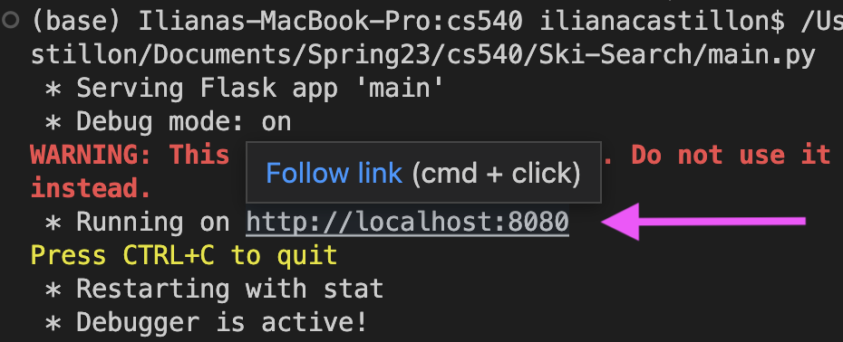
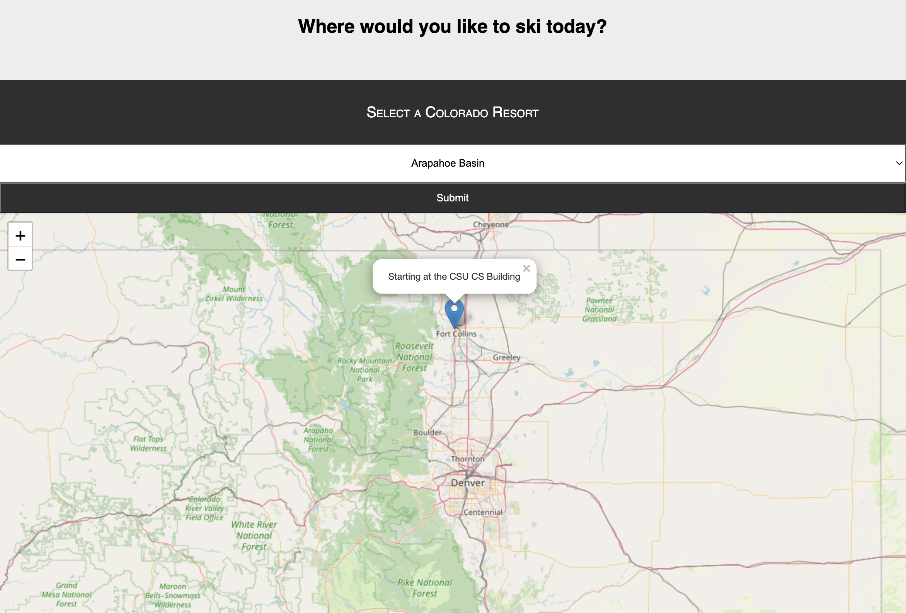
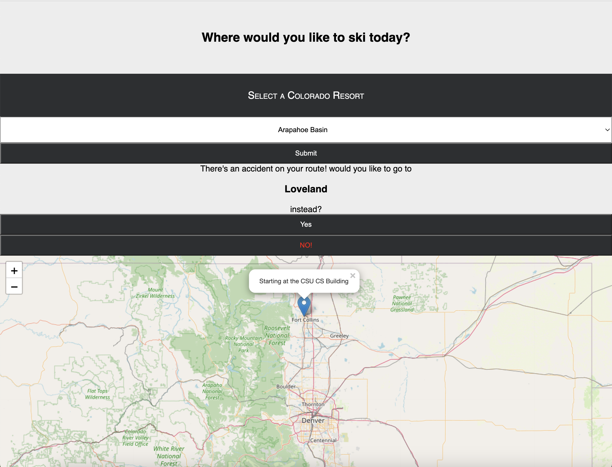
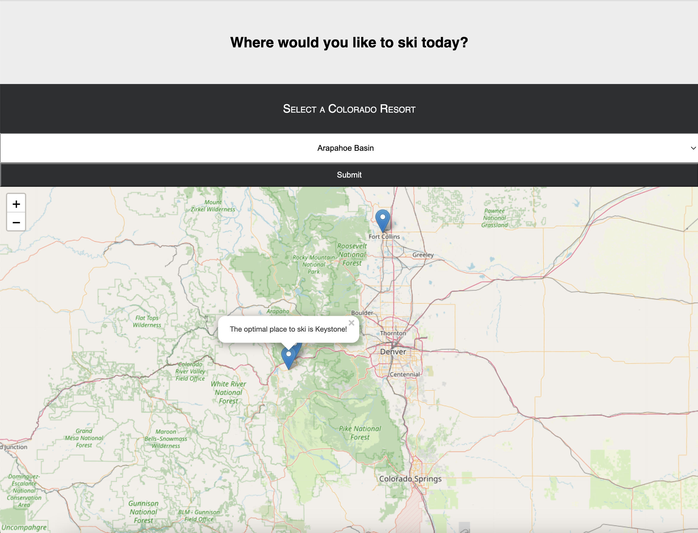

# SkiSearch

## Project description  
This is a program designed to recommend the optimal Colorado ski resort to travel to starting at Colorado State University

Created for CSU course CS540: Artificial Intelligence (Spring 2023)

## Data sources
The snow data we utilized is sourced from [OnTheSnow](https://www.onthesnow.com/colorado/skireport)

All of the traffic data is entirely simulated

## Real Time Changes 
At the time of finishing this project, most of the Colorado ski resorts had closed for the season. Due to this, all of the data in the repo comes from March 21st, 2023. To use live data, make changes in snow.py to use the pandas <code>OTS_df</code> data frame instead of <code>march_df</code>. 

## Dependencies/Python libraries used
- python 3.9
- pandas 
- flask
- json
- requests
- ast
- bs4
- heapq
- folium

## How to run 
- install all of the libraries listed above
- run main.py
- Click the local host link provided in the terminal, this will load the web application in a browser 

- from here, select which resort you would like to visit from the drop-down menu

- Depending on the resort selected, snow, and traffic data you may be rerouted to another destination. The user then has the option to accept or reject the new goal(s)

- When a final goal is reached, a marker with the optimal place to visit will appear on the map

